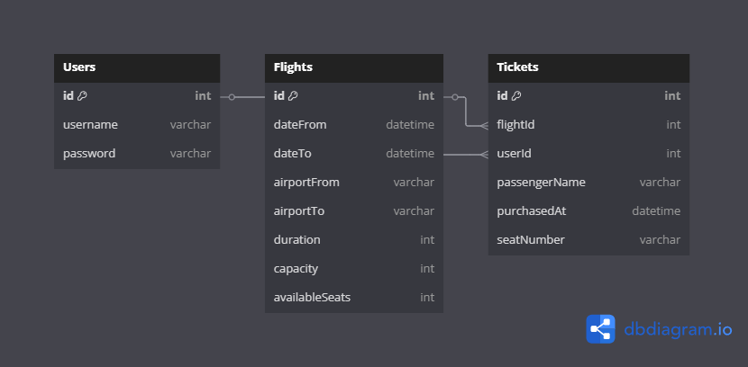

# Airline Ticketing API - SE4458 Midterm Project

This project is developed as part of the SE4458 Software Architecture & Design of Modern Large Scale Systems course.

> **Technologies used**: .NET 8, Entity Framework Core, Azure SQL, Azure App Service, Swagger, JWT Authentication

---

## 🔧 Features Implemented

| Feature              | Description                                                               |
| -------------------- | ------------------------------------------------------------------------- |
| Add Flight           | Adds a flight with specified info                                         |
| Query Flights        | Returns available flights (filters: date, airport, people, round/one-way) |
| Buy Ticket           | Buys ticket for flight if seats available, returns ticket number          |
| Check In             | Assigns seat number automatically                                         |
| Query Passenger List | Shows passenger list with seat numbers, supports paging                   |

## ✅ API Requirements Checklist

| API Endpoint         | Authentication | Paging | Versioned | Status |
| -------------------- | -------------- | ------ | --------- | ------ |
| Add Flight           | ✅ YES          | ❌ NO   | ✅ Yes     | ✅ Done |
| Query Flight         | ❌ NO           | ✅ YES  | ✅ Yes     | ✅ Done |
| Buy Ticket           | ✅ YES          | ❌ NO   | ✅ Yes     | ✅ Done |
| Check In             | ❌ NO           | ❌ NO   | ✅ Yes     | ✅ Done |
| Query Passenger List | ✅ YES          | ✅ YES  | ✅ Yes     | ✅ Done |

---

## 🔐 Authentication

JWT authentication is implemented.

- You must first call `/api/v1/Auth/login` with valid credentials.
- Use the token in Authorization header as `{token}`.

---

## 📦 Project Structure
```
AirlaneTicketingSystem/
│
├── 📁 Controllers/              # API uç noktaları
│   ├── AuthController.cs        # Login işlemi (JWT)
│   └── FlightController.cs      # Flight, Ticket, Check-in işlemleri
│
├── 📁 Data/                     # EF Core DbContext
│   └── AirlineDbContext.cs
│
├── 📁 Migrations/               # EF Core migration dosyaları
│   ├── *initial*.cs
│   ├── *_AzureInit.cs
│   ├── *_AddCheckInAndSeatToTicket.cs
│   ├── *_AddRoleToUser.cs
│   ├── *_DeleteRoleToUser.cs
│   └── AirlineDbContextModelSnapshot.cs
│
├── 📁 Models/                   # Entity ve DTO sınıfları
│   ├── Flight.cs
│   ├── Ticket.cs
│   ├── User.cs
│   ├── AddFlightDTO.cs
│   ├── BuyTicketDTO.cs
│   ├── CheckInDTO.cs
│   ├── CheckInResultDTO.cs
│   ├── FlightQueryDTO.cs
│   ├── LoginRequestDTO.cs
│   ├── PassengerInfoDTO.cs
│   └── PassengerQueryDTO.cs
│
├── 📁 Services/                 # Business logic servisleri
│   ├── FlightService.cs
│   ├── IFlightService.cs
│   └── JwtService.cs
│
├── AirlaneTicketingSystem.http # Test amaçlı HTTP istekleri
├── appsettings.json            # JWT, Connection String config
└── Program.cs                  # .NET uygulama başlangıç dosyası
```

---

## 📄 How to Run Locally

```bash
dotnet restore
dotnet ef database update
dotnet run
```

> Visit: `https://localhost:{port}/swagger`

---

## 🌐 Deployed On Azure

> **Live API:** [https://airlineapi-kaan.azurewebsites.net/swagger](https://airlineapi-kaan.azurewebsites.net/swagger)

---

## 🗃️ Data Model (ER Diagram)


- This contains the full entity relationship model.

---

## 🎥 Demo Video

A short demo of the project is available at:

>🔗 [Demo Video](https://drive.google.com/file/d/1nHhGYEFyXtnvoDVW09VTKVeDNkwe5KXr/view?usp=drive_link)


---

## 🧠 Assumptions

- Check-in is allowed only after ticket is bought.
- Flight capacity reduces after each ticket purchase.
- Passenger list includes only checked-in users.
- Seats are numbered in order of check-in.

---

## ⚠️ Known Issues / Limitations

- No cancellation endpoint yet.
- Ticket duplication prevention is basic.

---

## 👨‍💻 Developer

**Kaan Mert Kozalı**
Yaşar University, Computer Engineering
Student ID: 21070001064


